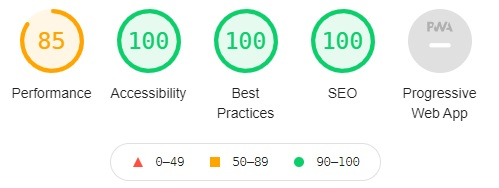

# Stand up Paddleboarding North East

SUP NE is a site to educated people in the activity of paddleboarding. Specificially it is dedicated to a group of people activitely engaging in the sport in the north east of England. The site will be useful for those in the area wanting to know more or meet up with experienced paddleboarders.


---

## Contents

- [Features](#features)
    - [Navigation](#navigation)
    - [Landing Page](#landing-page)
    - [Activities](#activities)
    - [Footer](#footer)
    - [Gallery](#gallery)
    - [Contact](#contact)
    - [Features not included](#features-not-included)
- [Testing](#testing)
- [Validation](#validation)
- [Deployment](#deployment)
- [Credits](#credits)

---

## Features 

- ### Navigation
    - The Main navigation bar is located at the top of all three pages and is identical to allow easy navigation.
    - The nav bar has hover over effects to draw the users attention to where they are about to visit.


- ### Landing Page
    - The landing page includes a large image to clearly show what the website is about.
    - It includes a text overlay to further explain what the purpose of the site is.


- ### Activities
    - The activities section gives more details about the sport of paddleboarding and offers some additional activities that can be enjoyed to entice the user into enquiring about paddleboarding.
    - The section is responsive to ensure the content is displayed in an easy to read format across multiple platforms.
    - The background color is consistent with the nav bar and other text to ensure a design that is pleasing to view.


- ### Footer
    - The footer includes links to various social media platforms encourage the user to join the community.
    - The links open in a new browser to allow easy navigation.
    - On hover they change to the brand colors of the platforms.


- ### Gallery
    - The Gallery provides the user with information into where the group has been.
    - It provides a launch board to what they could expect from trying out the sport.


- ### Contact
    - The contact page allows the user to leave their contact details for one of the group to get in touch and start sharing their love of the sport.


- ### Features not included
    - A page dedicated to reviews of equipment to help users make their first purchases.

---

## Testing
- The site has been tested in multiple browsers using devtools and [am i responsive](http://ami.responsivedesign.is/)
- The contact form has been tested and email validation is working.

---

## Validation
- HTML
    - No errors were returned when passing through the offical [W3C Validator](
    https://jigsaw.w3.org/css-validator/)
- CSS
    - No errors were returned when passing through the offical [jigsaw Validator](https://jigsaw.w3.org/css-validator/) 
- Accessibility
    - Font and Background colors are easy to read and accessible checked by running through lighthouse in devtools.



---

## Deployment
- The site was deployed to GitHub pages. The steps to deploy are as follows:
    - In the GitHub repository, navigate to the settings tab
    - From the settings tab, navigate to the pages tab
    - From the pages tab, navigate to the source section drop-down menu, select the main Branch
    - Once the main branch has been selected and saved, the page provided the link to the complete website.

The live link can be found here - [SUP NE](https://mealypudding.github.io/Portfolio1/)

---

## Credits

 - To understand some syntax of markdown I used [aimeos-typo3](https://github.com/aimeos/aimeos-typo3/blob/master/README.md#composer). In particular the addition of a contents page to the readme.md

 - To color the instagram on hover I used [stackoverflow](https://stackoverflow.com/questions/37751375/instagram-new-logo-css-background)
 ```
 background: radial-gradient(circle at 33% 100%, #fed373 4%, #f15245 30%, #d92e7f 62%, #9b36b7 85%, #515ecf)
 ```
 - To make a custom title icon I used [favicon](https://favicon.io/favicon-generator/)
 
 - The Hero image was taken from [pexels](https://www.pexels.com)
 - Gallery images were taken from [pexels](https://www.pexels.com)

 - Colors where chosen from [w3school palette](https://www.w3schools.com/colors/colors_palettes.asp)

 - The icons in the footer were taken from [Font Awesome](https://fontawesome.com/)